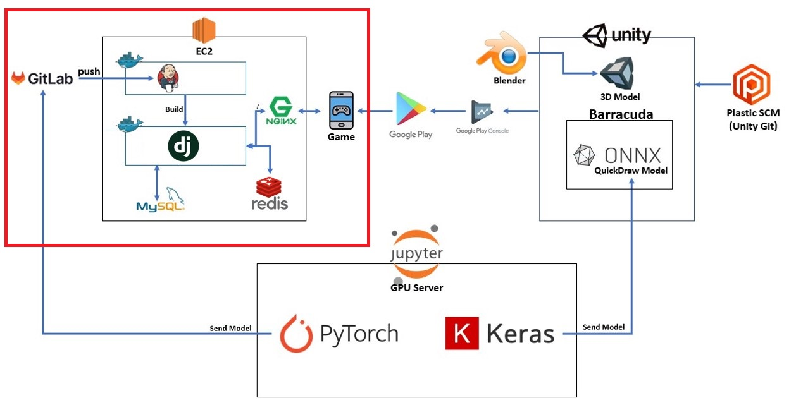
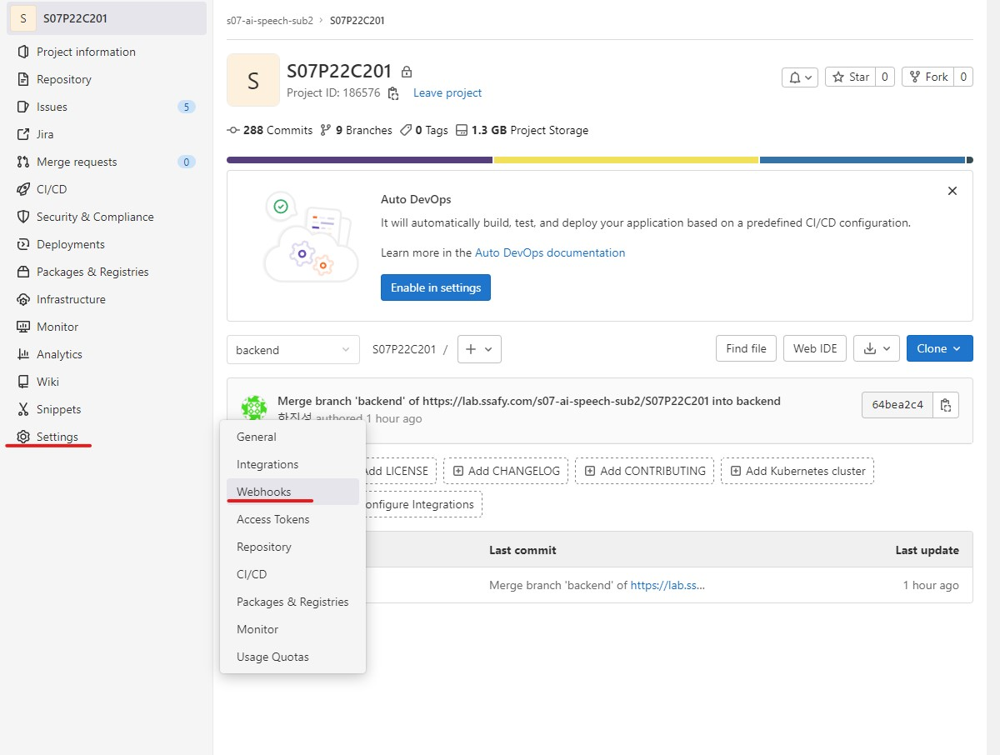
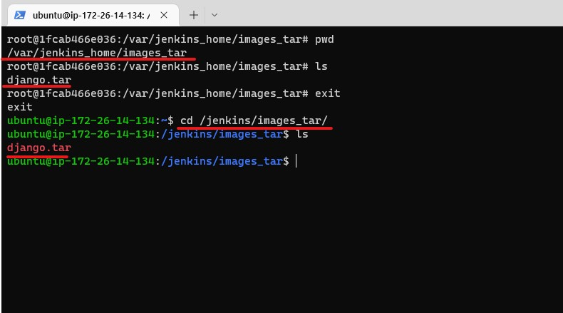
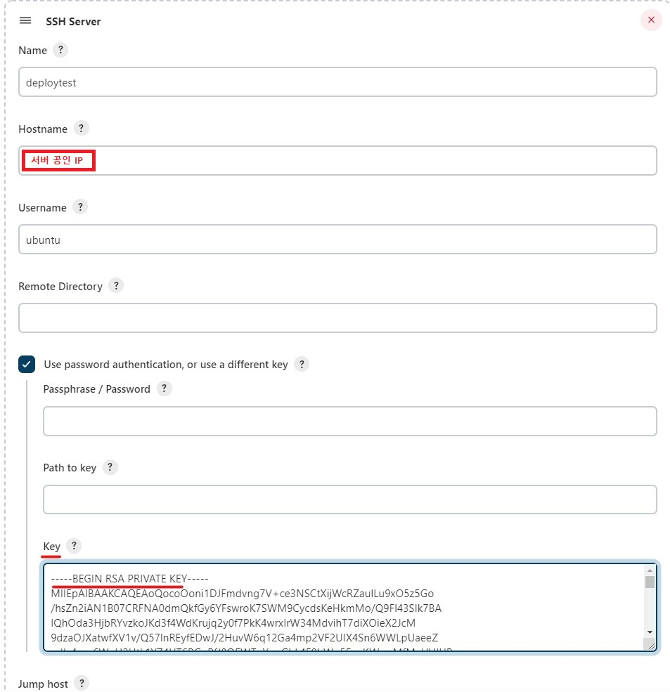
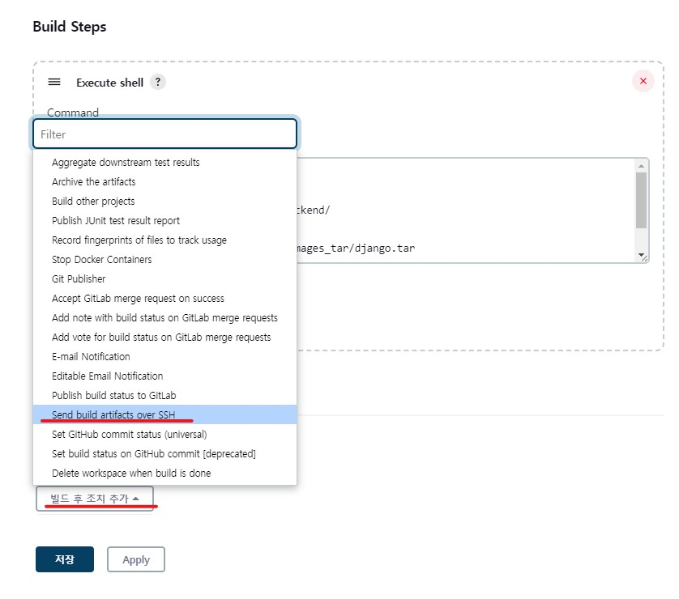
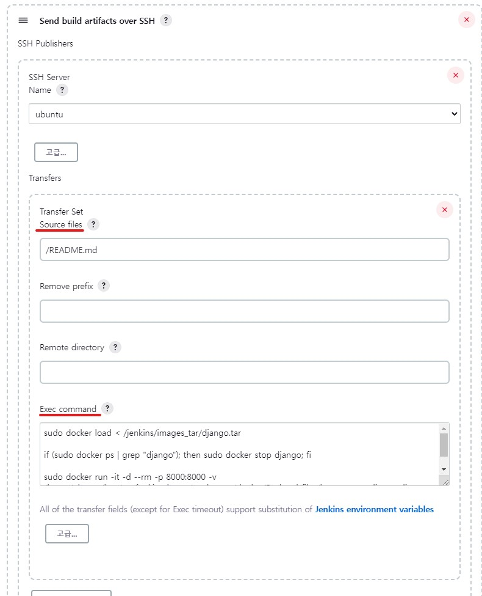
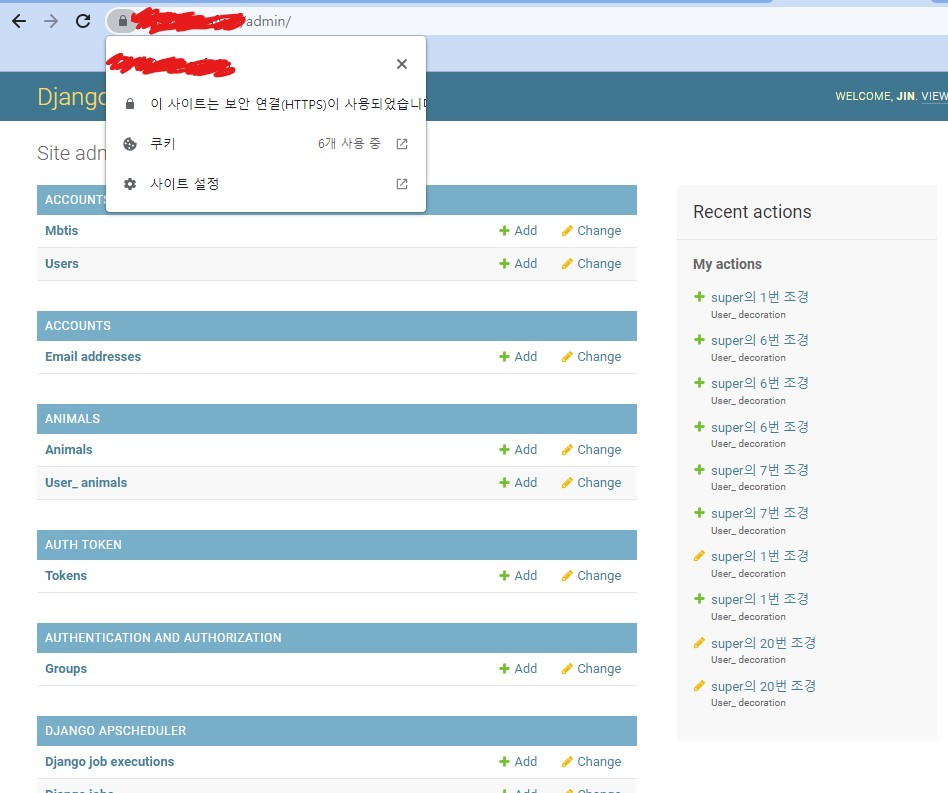

# CICD 배포 포팅 매뉴얼

본 글은 Django, Nginx를 이용하여 CICD 무중단 배포를 구축하는 방법에 대해 경험을 기반으로 작성한 글입니다.



위 사진이 구축하고자 하는 그림입니다(빨간색 시긱형 부분입니다). 작동 방식은 다음과 같습니다.

1. Gitlab Push Event가 일어나면
2. Jenkins에서 WebHook을 통해 자동으로 빌드를 실행
3. Jenkins에서 Django 프로젝트 내부의 DockerFile를 이용하여 Dockerimage 생성(tar 압축파일)
4. Jenkins에서 SSH 연결을 통해 AWS에 DockerContainer 생성
5. 외부에서 접속 : AWS에 설치된 Nginx에서 Django 컨테이너를 '/'로 연결

## 목차

1. [사전 준비 : AWS EC2 생성하기](#사전-준비--aws-ec2-생성하기)
2. [Docker 설치](#docker-설치)
3. [젠킨스 설치 및 계정 생성](#젠킨스-설치도커-컨테이너-및-계정-생성)
4. [젠킨스 프로젝트 생성, WebHook설정, 자동 빌드 테스트](#젠킨스-프로젝트-생성-webhook-설정-자동-빌드-테스트)
5. [젠킨스 도커 이미지 빌드](#젠킨스와-연결된-gitlab-프로젝트로-도커-이미지-빌드하기)
6. [젠킨스에서 SSH 명령어 전송하여 저장한 도커이미지로 컨테이너 생성](#젠킨스에서-ssh-명령어-전송을-통해-빌드한-도커-이미지를-베이스로-컨테이너-생성기본-배포-완료)
7. [nginx로 django 연결지어주기](#Nginx를-통한-Django-경로-설정-및-Https-적용)

## 사전 준비 : AWS EC2 생성하기

배포 환경을 구축하기 위해서는 서버용 PC가 필요합니다. 프로젝트 기간동안은 싸피에서 제공받은 EC2를 사용했지만, 프로젝트 기간이 지나면 더이상 EC2를 지원받지 못하기 때문에 개인 AWS 계정을 이용하여 EC2를 생성하는 것부터 시작하겠습니다.

:sparkles: EC2란? : AWS에서 제공하는 클라우드 컴퓨팅 서비스

#### :point_right: 로그인 및 콘솔 접속


aws 로그인 화면입니다. 계정이 없다면 만들어줍시다.


로그인에 성공하면 가장 먼저 해줄 것은 지역 설정입니다. 오른쪽 위의 지역을 클릭하여 서울로 만들어주겠습니다.


위 사진의 경로대로 따라가서 EC2 Management Console에 접속합니다.

#### :point_right: 인스턴스 생성


빨간 상자의 인스턴스 시작 버튼을 클릭해 줍니다.


인스턴스를 생성하는 창입니다. 이름은 적당한 이름으로, OS는 싸피에서 제공되는 OS인 Ubuntu, 버전 정보는 정확하지는 않지만 싸피에서 20.04 버전을 제공하는 것으로 예상하고 20.04버전을 선택하겠습니다.

#### :point_right: 인스턴스 유형


다음은 인스턴스 유형 칸입니다. 이 부분은 과금이 될 수 있는 부분으로 조심하셔야 합니다. AWS는 신규이용자에 한해서 1년간 프리티어 서비스를 통해 무료로 서버를 대여해주는 것으로 알고 있습니다.

프리티어 사용가능 이라고 적혀있는 유형은 일단은 무료로 이용할 수 있다고 생각하시면 됩니다.

하지만 무료버전에서는 배포 도중 자원 부족으로 서버 다운 등의 문제가 발생할 수 있습니다. 여기서는 잠깐 띄우고 삭제할 예정이므로 t3.medium 유형을 선택해주겠습니다.(시간당 71원 : 24시간 서비스 할 경우 한 달에 약 50000원 :open_mouth:)

#### :point_right: 키 페어 생성


다음으로 새 키 페어 생성을 클릭해줍니다.


적당한 키 페어 이름을 설정하고, 키 페어 생성 버튼을 누르면 pem 파일을 다운로드 받을 수 있습니다. 이 파일은 AWS SSH 로그인이나 젠킨스 SSH 연결 등에 사용되는 중요한 키이므로 잘 저장해 둡시다.


키 페어에 생성한 키를 선택해줍니다.

#### :point_right: 네트워크 설정

다음은 네트워크 설정입니다. 위 사진의 편집 버튼을 클릭해줍니다.

네트워크 설정은 기본적으로 22번 Port, SSH 연결만 허용되어 있습니다. 몇 가지 포트를 허용하는 규칙을 추가해보겠습니다.


보안 그룹 규칙 추가 버튼을 클릭합니다.


HTTP와 같이 80포트로 정해져 있는 것은 선택하여 바로 규칙으로 추가할 수 있고, 사용자 지정 포트도 규칙에 추가하여 허용해줄 수 있습니다.

저는 HTTP, HTTPS, 9090(jenkins), 8080(django Nginx 연결 이전) 포트를 개방해주었습니다.


그 아래의 소스 유형의 경우에는 접근 가능한 IP를 설정해 주는 부분입니다. 위치 무관을 선택하면 어디서든 해당 포트로 접속(0.0.0.0)이 가능합니다.

#### :point_right: 스토리지 구성


스토리지는 프리티어 단계에서 최대 30GB까지 무료로 제공됩니다. 그 이상부터는 과금이 들어갑니다.

#### :point_right: 인스턴스 시작


여기까지 설정이 완료되었으면 인스턴스 시작 버튼을 클릭하여 인스턴스를 시작하면 됩니다.


인스턴스 시작 성공 화면입니다.

#### :point_right: 탄력적 IP


인스턴스 목록 창을 보면 방금 생성한 인스턴스가 있는 것을 확인할 수 있습니다.

제가 기존에 생성했던 인스턴스와 비교해보면 밑줄 쳐놓은 부분이 다른 것을 확인할 수 있습니다.

AWS에서는 인스턴스에 대해 퍼블릭 IP를 제공합니다. 하지만 이는 유동적으로 제공되는 IP로, 인스턴스를 중지했다가 다시 시작하면 기존의 IP가 아닌 새로운 IP가 부여되게 됩니다.

만약 서비스를 재시작했는데, 접속 IP가 변경되면 해당 서버에 접속하기가 어려워지겠죠? 그래서, AWS는 탄력적 IP를 제공함으로써 고정된 Public IP를 사용할 수 있게 해주었습니다.

탄력적 IP역시 과금이 들어가는 부분이 있습니다. 자세히는 모르지만 한 개만 사용할 때는 요금이 들지 않고, 1개 초과로 사용할 경우 요금이 발생하는 것으로 알고있습니다.


탄력적 IP 생성을 하기 위해 탭에서 탄력적 IP로 이동합니다.


할당 버튼을 클릭하면 탄력적 IP가 생성됩니다. 저는 미리 만들어둔 IP가 있으므로 생략하겠습니다.

이제, 할당한 탄력적 IP를 인스턴스에 연결해보겠습니다.


빨간색으로 칠해진 부분을 클릭합니다.


탄력적 IP 주소 연결 버튼을 클릭합니다.


인스턴스를 선택해주고, 재연결 허용여부 체크박스를 체크해줍니다. 그 후 연결 버튼 클릭 시 연결 완료입니다.

#### :point_right: SSH 연결


PC에서 SSH 연결을 진행해보겠습니다. 아까 키 페어 생성할 때 다운받은 Pem 파일이 있는 폴더에서 다음 명령어를 입력합니다. 이후 yes를 입력하면 접속이 완료됩니다.


:satisfied: 여기까지 완료했으면 AWS 세팅은 완료되었습니다! 싸피에서 EC2를 제공받을 경우 AWS 관련 설정이 다를 수 있습니다.

## Docker 설치

Ubuntu 환경이 준비되었습니다. 여기에 Docker를 먼저 설치하겠습니다.

[참고 링크](https://dongle94.github.io/docker/docker-ubuntu-install/)

도커 설치를 위해 필요한 패키지들을 설치합니다. 설치 명령어는 다음과 같습니다.

#### :point_right: 사전 패키지 설치

```
sudo apt update
sudo apt-get install -y ca-certificates \
    curl \
    software-properties-common \
    apt-transport-https \
    gnupg \
    lsb-release
```

도커를 설치하기 위해 gpg Key를 다운받아야 합니다. 이는 리눅스 패키지 툴이 프로그램 패키지가 유효한지 확인하기 위해 설치 전에 gpg 키를 통해 검증하는 과정을 거치기 때문에 gpg 키를 받아야 한다고 합니다.

#### :point_right: gpg 키 다운로드

```
sudo mkdir -p /etc/apt/keyrings
curl -fsSL https://download.docker.com/linux/ubuntu/gpg | sudo gpg --dearmor -o /etc/apt/keyrings/docker.gpg

echo \
    "deb [arch=$(dpkg --print-architecture) signed-by=/etc/apt/keyrings/docker.gpg] https://download.docker.com/linux/ubuntu \
    $(lsb_release -cs) stable" | sudo tee /etc/apt/sources.list.d/docker.list > /dev/null
```

#### :point_right: Docker 설치

`apt update`를 다시 실행해주고, 아래 명령어를 통해 도커를 설치합니다. `docker-compose`는 추가로 설치합니다.(젠킨스 설치할 때 편하게 하기 위해 씁니다. 다른 사용법도 있는데 저는 이번에는 쓰지 않았습니다.)

```
sudo apt update
sudo apt install docker-ce docker-ce-cli containerd.io docker-compose
```

여기까지 하면 EC2에 도커 설치는 완료되었습니다.

## 젠킨스 설치(도커 컨테이너) 및 계정 생성

참고사항
- [참고 링크](dongyeon1201.kr/9026133b-31be-4b58-bcc7-49abbe893044)

#### :point_right: docker-compose 이용 젠킨스 컨테이너 생성

다음은 도커에 젠킨스를 이미지를 이용해 설치해보겠습니다.


위 사진과 같이 명령어를 쳐서 `docker-compose.yml` 파일을 vim을 이용하여 생성해줍니다.

docker-compose.yml 파일
```
version: '3'

services:
    jenkins:
        image: jenkins/jenkins:lts
        container_name: jenkins
        volumes:
            - /var/run/docker.sock:/var/run/docker.sock
            - /jenkins:/var/jenkins_home
        ports:
            - "9090:8080"
        privileged: true
        user: root
```

위 내용을 복사하여 붙여넣기합니다. 각 단어에 대한 설명은 간단하게만 하겠습니다.

- services : 컨테이너 서비스
- jenkins : 서비스 이름
- image : 컨테이너 생성시 사용할 image, 여기서는 jenkins/jenkins:lts 이미지를 사용(jenkins의 lts버전을 가져온다는 뜻)
- container_name : 컨테이너 이름
- volumes : 공유 폴더 느낌, aws의 /var/run/docker.sock와 컨테이너 내부의 /var/run/docker.sock를 연결, /jenkins 폴더와 /var/jenkins_home 폴더를 연결.
- ports : 포트 매핑, aws의 9090 포트와 컨테이너의 8080 포트를 연결한다.
- privileged : 컨테이너 시스템의 주요 자원에 연결할 수 있게 하는 것 기본적으로 False로 한다고 한다.
- user : 젠킨스에 접속할 유저 계정 (root로 할 경우 관리자)


이후 esc를 누른 후 :wq 를 입력하여 파일을 저장합니다.


`sudo docker-compose up -d` 명령어를 입력하여 컨테이너를 생성해줍니다.


`sudo docker ps` 명령어로 확인해보면 다음과 같이 컨테이너가 올라가 있는 것을 확인할 수 있습니다.

#### :point_right: 젠킨스 계정 생성 및 플러그인 설치


서버 공인  IP:9090 포트로 접속하면 다음과 같은 젠킨스 시작 화면이 나타나게 됩니다.


여기서 말하는 Administrator password는 `sudo docker logs jenkins` 명령어를 통해 위 사진의 빨간 네모 상자 안의 값을 입력해줍니다.

다음으로 두 개의 버튼 중 `Install suggested plugins`를 클릭해줍니다.(기본 플러그인 자동 설치 느낌, 다른 버튼은 사용자 지정 플러그인 설치 같은 느낌입니다.)


이것 저것 플러그인들이 설치되는 모습입니다.


젠킨스 계정 생성 form입니다. 적당히 입력하고 `Save and Continue` 버튼을 눌러줍니다.

이후 `Save and Finish`, `Start using Jenkins` 버튼을 이어서 눌러 젠킨스를 시작해줍니다.


젠킨스 시작 메인화면입니다. 플러그인 설치를 위해 jenkins 관리 탭을 클릭해줍니다.


플러그인 관리 페이지로 이동합니다.


먼저 설치 가능 탭으로 탭을 변경해주고, 검색어에 `gitlab`을 검색합니다.

그 후, 밑줄 친 플러그인들을 체크하고, `install witout restart` 버튼을 클릭해줍니다.


같은 방식으로 Docker 관련 플러그인도 설치해줍니다.


마지막으로 SSH 연결 관련 플러그인까지 설치하겠습니다.


모두 설치가 완료되었습니다.

## 젠킨스 프로젝트 생성 WebHook 설정, 자동 빌드 테스트

참고사항
- [참고 링크](https://zunoxi.tistory.com/106)

이제, 젠킨스에서 프로젝트를 생성하고, 깃랩과 WebHook으로 연결하여 자동으로 빌드를 진행하는 것을 테스트하겠습니다.

#### :point_right: 깃랩 Repo


여기서는 Backend 폴더에 Django 프로젝트가 들어있습니다. `project`는 Django 프로젝트의 프로젝트 명입니다.

#### :point_right: 젠킨스 프로젝트 생성


젠킨스 메인페이지에서 `새로운 item` 을 클릭합니다.


프로젝트 이름은 `deploytest`, `Freestyle project`를 클릭하고 `OK` 버튼을 클릭합니다.


`소스코드 관리` 탭을 클릭하고, None로 되어있는 것을 git 라디오 버튼을 클릭하면 아래에 Form이 나타납니다.


`Repository URL`에는 싸피깃 레포지토리 URL을 입력해줍니다. 위 사진처럼 에러 메시지가 나타나는 것이 지금 단계에서는 정상입니다.


`Credentials`에서, `add` -> `jenkins`를 클릭해줍니다.


- Username : 싸피깃 아이디
- Password : 싸피깃 비밀번호
- ID : Credential 구별할 아무 텍스트 입력하면 됩니다.

위 내용 입력하고 `Add` 버튼 클릭합니다.


 `Credentials`에서 이제 만들어진 `Credential`을 선택했을 때 오류메시지가 사라지면 성공입니다.


다음은 빌드 유발 탭입니다. 빌드 유발 탭에서는 먼저 밑줄 친 부분의 체크박스를 체크해줍니다. 그 후 생기는 고급 버튼을 클릭합니다.


그 후 조금 스크롤을 내려 `Secret token`을 찾아 Generate 버튼을 누르면 사진과 같이 토큰이 생성됩니다. 이 토큰은 Gitlab과 WebHook을 연결할 때 사용되니 저장해둡니다.


다음은 Build 탭입니다. `Add build step`를 클릭하고, `Execute Shell`을 선택해줍니다.


다음과 같이 명령어를 입력할 수 있는 칸이 나타납니다. 일단 연결만 테스트하는 것이기 때문에 pwd 명령어를 입력하겠습니다.

여기까지 모두 완료했다면 저장 버튼을 눌러 저장합니다.


저장 버튼을 누르면 위 사진처럼 프로젝트 화면으로 이동합니다. 일단 `지금 빌드` 버튼을 눌러서 젠킨스 수동 빌드를 진행해봅니다. 아래 밑줄처럼 완료 표시가 뜨면 성공한 것입니다.


빌드 히스토리에서, `Console Output`에 들어가보겠습니다.


빌드에 성공한 console 창입니다. 입력해두었던 명령어 pwd도 잘 작동한 것을 확인할 수 있습니다.

#### :point_right: 깃랩 WebHook 연결

다음은 싸피깃 레포지토리와 젠킨스를 `WebHook`으로 연결하여 자동 빌드를 진행해보겠습니다.



배포할 프로젝트가 있는 깃랩 `Repository`에서 밑줄친 위치로 `WebHooks` 페이지로 이동합니다.

 56.jpg 사진 변경 필요

URL에는 `http://배포서버공인IP:9090/project/생성한jenkins프로젝트이름/`을 입력해줍니다.

Secret token에는 아까 위에서 젠킨스 프로젝트를 생성할 때 저장해둔 값을 입력합니다.

빌드 유발 Trigger으로, `Push events, Merge request events`를 설정합니다. 대상 Branch는 master으로 설정합니다.

완료했다면 Add Webhook 버튼을 눌러 webhook을 생성합니다.


WebHook을 생성하고 나면 빌드 테스트를 위해 생성된 WebHook에서 test를 누르고, Push events를 선택해줍니다.


응답이 잘 넘어온 것을 확인할 수 있습니다. (code 200)


젠킨스에서도 정상적으로 빌드가 수행되는 것을 확인할 수 있습니다.

:satisfied: 여기까지 완료했으면 이제 `Jenkins`와 `Gitlab`이 연결되었습니다! 연결된 `Gitlab`의 `master branch`에 이벤트가 발생하면, 젠킨스에서는 빌드를 수행하게 됩니다!

## 젠킨스와 연결된 gitlab 프로젝트로 도커 이미지 빌드하기

참고사항
- [참고 링크](https://sinawi.tistory.com/371)

젠킨스에서 도커 빌드를 하기 위해서는 젠킨스 컨테이너 안에 도커를 설치해야 합니다. 도커 설치 방법은 Ec2에 도커를 설치할 때와 동일하게 진행합니다.

먼저 젠킨스 bash shell에 접근해보겠습니다. 명령어는 `sudo docker exec -it jenkins bash` 입니다.


정상적으로 접속되면 다음과 같은 화면이 됩니다. 이제 이 환경에 docker를 다시 설치하도록 합니다.

#### :point_right: 사전 패키지 설치

```
apt update
apt-get install -y ca-certificates \
    curl \
    software-properties-common \
    apt-transport-https \
    gnupg \
    lsb-release
```

루트계정으로 접속되어있기 때문에, 젠킨스 컨테이너 내부에서는 명령어에 sudo를 지워야합니다.

#### :point_right: gpg 키 다운로드

```
mkdir -p /etc/apt/keyrings
curl -fsSL https://download.docker.com/linux/debian/gpg | gpg --dearmor -o /etc/apt/keyrings/docker.gpg

echo \
    "deb [arch=$(dpkg --print-architecture) signed-by=/etc/apt/keyrings/docker.gpg] https://download.docker.com/linux/debian \
    $(lsb_release -cs) stable" | tee /etc/apt/sources.list.d/docker.list > /dev/null
```

젠킨스에 gpg 키를 다운로드 받을 때의 변경사항입니다.


젠킨스 컨테이너 내부에서 설치된 `os`을 체크하는 명령어 `cat /etc/issue`를 통해 `os`를 확인해보면 `debian`으로 나타나는 것을 확인할 수 있습니다.

기존 링크에서 제공한 방식은 `ubuntu os`에 대한 `gpg` 키를 다운로드 하는 것이기 때문에, 이를 `debian`으로 바꾸어주어야 합니다.

이를 바꾸지 않으면 패키지를 찾지 못하는 에러가 발생합니다.

기존 명령어에서 `ubuntu`로 되어있는 부분을 `debian`으로 바꾸어주면 해결됩니다.

#### :point_right: Docker 설치

```
apt update
apt install docker-ce docker-ce-cli containerd.io docker-compose
```

여기까지 진행하면 `Jenkins Container`에도 `Docker`가 설치 완료되었습니다.

#### :point_right: 프로젝트에 DockerFile 작성

이제 깃랩의 각 프로젝트 폴더에 DockerFile을 만들어 명령어를 입력해주겠습니다.

Django Project DockerFile
```
FROM python:3.10.5
WORKDIR /var/jenkins_home/workspace/deploytest/Backend
COPY requirements.txt ./

RUN pip install --upgrade pip
RUN pip install -r requirements.txt
COPY . .
CMD ["gunicorn", "project.wsgi", "--bind", "0.0.0.0:8000"]
```

`Django DockerFile`에서는 `Python 3.10.5` 이미지를 베이스 이미지로 두고, `Requirements`를 통해 pip 패키지를 설치한 후, 프로젝트 폴더를 이미지에 복사, 그후 `CMD`를 통해 컨테이너를 실행하도록 하였습니다.

간단 명령어 설명
- FROM : 베이스 이미지를 지정
- WORKDIR : 작업 디렉토리 설정
- COPY : 파일 복사 <Host 파일 경로> <Docker 이미지 파일 경로>
- RUN : 명령 실행
- CMD 컨테이너 실행 명령

해당 레포지토리에 도커파일은 이미 저장되어있습니다. 다음은 젠킨스에서 이 도커파일을 이용해서 이미지를 생성하도록 해보겠습니다.

#### :point_right: 젠킨스에서 DockerFile 이용 도커 이미지 생성


젠킨스 프로젝트 페이지에서, 구성 버튼을 클릭합니다.


그럼 아까 프로젝트 생성할 때의 창과 비슷한 창이 나타납니다. Build 탭으로 이동하고, 아까 프로젝트 생성할 때 pwd로 적어두었던 명령어를 다음 명령어로 바꾸어줍니다.

```
docker image prune -a --force
mkdir -p /var/jenkins_home/images_tar
cd /var/jenkins_home/workspace/deploytest/Backend/
docker build -t django .
docker save django > /var/jenkins_home/images_tar/django.tar

ls /var/jenkins_home/images_tar
```

위 명령어에 대한 개별 설명

- docker image prune -a --force : 사용하지 않는 이미지 삭제
- mkdir -p /var/jenkins_home/images_tar : 도커 이미지 압축파일을 저장할 폴더 생성
- cd /var/jenkins_home/workspace/deploytest/Backend/ : 해당 경로로 이동(django 프로젝트 폴더)
- docker build -t django . : 도커 이미지 빌드(Django 프로젝트)
- docker save django > /var/jenkins_home/images_tar/django.tar : 도커 이미지를 django.tar로 압축하여 위에서 생성한 폴더에 저장
- ls /var/jenkins_home/images_tar : 해당 폴더에 있는 파일 목록 출력(잘 압축되어 저장되었는지 확인)

이후 저장 버튼을 눌러줍니다.


그 후 지금 빌드 버튼을 눌러 빌드해줍니다.


열심히 일하고 있는 젠킨스 할아버지 :cry:


프로젝트에 오타가 있어서 수정하는 김에 `Push event`를 이용하여 자동으로 빌드되는 것 까지 테스트 해보았습니다.


빌드에 성공했다는 메시지입니다.



이 글 초반부의 젠킨스 컨테이너 생성할 때의 `docker-compose.yml` 파일이 기억 나시나요? 그 때 공유 폴더로 aws의 `/jenkins`와  `/var/jenkins_home`를 연결했었습니다.

젠킨스 컨테이너 안의 `/var/jenkins_home/images_tar` 폴더 안에 tar 파일이 생성되어있고, 폴더를 공유하는 EC2의 `/jenkins/images_tar`에도 똑같이 tar 파일이 생성되어 있는 것을 확인할 수 있습니다.

:satisfied: 여기까지 완료했으면 젠킨스에서 도커 이미지를 빌드하여 tar 압축파일로 생성하는 부분까지 완성되었습니다!

## 젠킨스에서 SSH 명령어 전송을 통해 빌드한 도커 이미지를 베이스로 컨테이너 생성(기본 배포 완료)

참고자료
- [젠킨스 aws ssh 연결 시 pem 파일의 개인키로 안되면 해당 링크 참조](https://velog.io/@dahunyoo/AWS-EC2-%EA%B3%84%EC%A0%95-%EC%95%94%ED%98%B8%EC%84%A4%EC%A0%95%ED%95%98%EA%B8%B0-Jenkins-SSH%EB%A5%BC-%EC%9D%B4%EC%9A%A9%ED%95%B4%EC%84%9C-%EB%B0%B0%ED%8F%AC%ED%95%B4%EB%B3%B4%EA%B8%B0)

#### :point_right: 젠킨스 SSH 연결 설정 (Publish over SSH)

젠킨스에서 AWS으로 SSH 명령어를 전송하려면 AWS 인증 키(EC2 생성할 때 사용한 pem 파일)를 등록해주어야 합니다.


젠킨스 홈페이지에서 `Jenkins 관리`를 클릭하고, 이어서 `시스템 설정`을 클릭합니다.


시스템 설정 칸에서 스크롤을 아래로 쭉 내리면 `Public over SSH` 항목이 있습니다. 여기서 `SSH Servers` 추가 버튼을 눌러줍니다.


- Name : 그냥 이름
- Hostname : EC2 IP
- Username : EC2 접속 계정 이름

위 내용을 작성하고 고급 버튼을 클릭해줍니다.


다른 건 건드리지 않고, `Use password authentication, or use different key` 체크박스를 체크해줍니다.

그러면 아래에 사진 처럼 Form이 생성됩니다. 다른 값은 입력하지 않고 Key에만 값을 입력하겠습니다.


EC2에서 생성한 키 페어 pem 파일을 VSCode로 오픈해주겠습니다.


pem 파일은 다음과 같은 구성으로 되어있습니다. 이 텍스트 내용을 전체 복사해줍니다.



복사한 내용을 Key 칸에 붙여넣기 해줍니다.


이후 `Test Configuration` 버튼을 눌렀을 때 Success가 나오면 성공입니다. 하지만 여기서는 오류가 나는 모습입니다.

:sparkles: 이 오류에 대해 구글링을 조금 해본 결과, ubuntu 버전이 18.xx 버전보다 높은 경우에 pem 키로 인증이 실패하는 경우가 있다는 것을 알게 되었습니다. 이 경우에는 Pem 키로 인증하는 것이 아닌, ubuntu 계정의 비밀번호를 설정하여 연결하는 방법을 사용하면 해결됩니다.

#### :point_right: SSH 연결 오류 해결 방법

가장 먼저, root 계정 비밀번호를 설정해줍니다. 명령어는 `sudo passwd`입니다. 비밀번호는 공격이 어렵게 복잡하게 설정하는 것이 좋습니다.


비밀번호를 설정했으면 `su -` 명령어를 통해 root 계정으로 접속합니다. 이후, `passwd ubuntu` 명령어를 이용해 ubuntu 계정의 패스워드를 설정해줍니다. 이 역시 복잡한 패스워드가 좋습니다.(잘못하면 해킹당함)


패스워드 설정이 완료되었습니다. 하지만, EC2에는 기본적으로 id,pw을 이용한 로그인이 차단되어있습니다. 이제 이를 해제해보겠습니다.

계속해서 root 계정으로 접속된 상태에서 `vim /etc/ssh/sshd_config` 명령어를 통해 `sshd_config` 파일을 열어줍니다.


그러면, 위 사진과 같이 vim 편집기가 열립니다. 이 때, 키보드를 이용하여 아래로 조금씩 내리면서 밑줄 친 부분을 찾습니다. `PasswordAuthentication`을 no에서 yes으로 바꾸고, `esc :wq` 를 통해서 저장해줍니다.

마지막으로 `service sshd reload` 명령어를 통해 sshd를 재시작해줍니다.

이제 다시 젠킨스로 돌아옵니다.


기존에 있던 `pem key` 데이터는 지워버립니다. 그리고, `Passphrase/Password` 칸에 아까 설정했던 ubuntu 계정의 패스워드를 입력해줍니다.


다시 `Test Configuration`버튼을 눌러보겠습니다. 이제는 Success가 뜨는 것을 확인할 수 있습니다.

SSH 연결이 완료되었습니다. 저장 버튼을 눌러 저장해주겠습니다.

#### :point_right: 젠킨스 빌드 후 조치로 SSH 명령어 전송(EC2에 도커 컨테이너 생성)


젠킨스 프로젝트 페이지에서, 다시 구성 버튼을 클릭합니다.



빌드 후 조치 탭에서, 빌드 후 조치 추가를 클릭, `Send build artifacts over SSH`를 선택합니다.

 83.jpg 사진 변경 필요

`Source files`는 컨테이너에서 aws로 파일을 전송하는 부분인데, 의미가 없는데도 필수 입력 사항이기 때문에 적당히 아무거나 적어줍니다. 중요한 부분은 `Exec command`부분에 아래 명령어를 복사 붙여넣기 해줍니다.

```
sudo docker load < /jenkins/images_tar/django.tar

if (sudo docker ps | grep "django"); then sudo docker stop django; fi

sudo docker run -it -d --rm -p 8000:8000 -v /home/ubuntu/log:/var/jenkins_home/workspace/deploytest/Backend/files/log  --name django django

```

명령어 간단 설명 (django와 중복되는 명령어는 한 개만 설명)
- sudo docker load < /jenkins/images_tar/django.tar : django0.tar을 압축 해제하여 docker 이미지로 등록
- if (sudo docker ps | grep "django then sudo docker stop django; fi : django 컨테이너가 만약 동작중이면 stop 시키기
- sudo docker run -it -d --rm -p 8000:8000 -v /home/ubuntu/log:/var/jenkins_home/workspace/deploytest/Backend/files/log  --name django django : 컨테이너 생성하기 8000 포트로 연결, 컨테이너 이름은 django로, log 파일 저장을 위한 컨테이너와 aws에 volume 연결

이후 저장 버튼을 눌러줍니다.


이제 지금 빌드 버튼을 눌러 빌드해주면.


콘솔에서 결과를 확인할 수 있고.


8000포트에는 Django를 서비스하게 됩니다.

:satisfied: 여기까지 도커 젠킨스를 이용한 CICD 자동배포가 완료되었습니다!

1. Gitlab Push Event가 일어나면
2. Jenkins에서 WebHook을 통해 자동으로 빌드를 실행
3. Jenkins에서 Django 프로젝트 내부의 DockerFile를 이용하여 Dockerimage 생성(tar 압축파일)
4. Jenkins에서 SSH 연결을 통해 AWS에 DockerContainer 생성
5. 외부에서 접속 : AWS에 설치된 Nginx에서 Django 컨테이너를 '/'로 연결

처음 설명했던 작동방식 1~5중에서 4번까지 완료되었습니다. 다음은 정말 마지막 설정인 Nginx Proxy 설정입니다.

## Nginx를 통한 Django 경로 설정 및 Https 적용

구성도에 따라 nginx는 aws EC2에 설치하도록 하겠습니다.

#### nginx 설치

먼저 우분투 환경(EC2)에 Nginx를 설치해보겠습니다.

```
sudo apt update
sudo apt upgrade
sudo apt install nginx
```

위 명령어를 입력하여 실행하면 nginx는 설치가 완료됩니다.

#### ret's encrypt 이용하여 nginx에 TLS 인증서 적용하기

```
sudo add-apt-repository ppa:certbot/certbot
sudo apt-get update
sudo apt-get install python-certbot-nginx
```

위 명령어를 입력하여 EC2에 certbot을 설치합니다.

```
sudo certbot --nginx
```

그 다음 위 명령어를 입력하여 인증서 발급을 시작합니다.

```
Saving debug log to /var/log/letsencrypt/letsencrypt.log
Plugins selected: Authenticator nginx, Installer nginx
Enter email address (used for urgent renewal and security notices) (Enter 'c' to
cancel): emailsample@naver.com
```
그러면 위와 같은 창이 나타널 것입니다. email 주소를 적어주세요.

```
Please read the Terms of Service at
https://letsencrypt.org/documents/LE-SA-v1.3-September-21-2022.pdf. You must
agree in order to register with the ACME server at
https://acme-v02.api.letsencrypt.org/directory
- - - - - - - - - - - - - - - - - - - - - - - - - - - - - - - - - - - - - - - -
(A)gree/(C)ancel: A
```

약관동의에 관한 안내문입니다. 약관에 동의해야 진행이 가능하니 A를 입력하고 엔터해주시면 됩니다.

```
Would you be willing to share your email address with the Electronic Frontier
Foundation, a founding partner of the Let's Encrypt project and the non-profit
organization that develops Certbot? We'd like to send you email about our work
encrypting the web, EFF news, campaigns, and ways to support digital freedom.
```

관련 정보를 이메일로 받을 지 설명하는 부분입니다. 이메일 수신 동의 시 Y 또는 Yes를 입력합니다.

```
No names were found in your configuration files. Please enter in your domain
name(s) (comma and/or space separated)  (Enter 'c' to cancel): j7c201.p.ssafy.io
```

https를 설정할 domain name를 입력해달라는 요청입니다. TLS 인증서를 적용할 domain name을 입력해줍니다.

여기까지 진행했다면 nginx에 TLS 인증서 반영이 성공하였습니다.

다음으로, nginx의 설정파일을 수정하여 docker 컨테이너와 연결해보겠습니다.

```
sudo vim /etc/nginx/sites-available/default
```

해당 명령어를 통해 default 파일을 편집기로 오픈합니다.

```
##
# You should look at the following URL's in order to grasp a solid understanding
# of Nginx configuration files in order to fully unleash the power of Nginx.
# https://www.nginx.com/resources/wiki/start/
# https://www.nginx.com/resources/wiki/start/topics/tutorials/config_pitfalls/
# https://wiki.debian.org/Nginx/DirectoryStructure
#
# In most cases, administrators will remove this file from sites-enabled/ and
# leave it as reference inside of sites-available where it will continue to be
# updated by the nginx packaging team.
#
# This file will automatically load configuration files provided by other
# applications, such as Drupal or Wordpress. These applications will be made
# available underneath a path with that package name, such as /drupal8.
#
# Please see /usr/share/doc/nginx-doc/examples/ for more detailed examples.
##

# Default server configuration
#
upstream backend {
   server 172.26.14.134:8000;
}

map $http_upgrade $connection_upgrade {
   default upgrade;
   ''      close;
}

server {
  ##
  # You should look at the following URL's in order to grasp a solid understanding
  # of Nginx configuration files in order to fully unleash the power of Nginx.
  # https://www.nginx.com/resources/wiki/start/
  # https://www.nginx.com/resources/wiki/start/topics/tutorials/config_pitfalls/
  # https://wiki.debian.org/Nginx/DirectoryStructure
  #
  # In most cases, administrators will remove this file from sites-enabled/ and
  # leave it as reference inside of sites-available where it will continue to be
  # updated by the nginx packaging team.
  #
  # This file will automatically load configuration files provided by other
  # applications, such as Drupal or Wordpress. These applications will be made
  # available underneath a path with that package name, such as /drupal8.
  #
  # Please see /usr/share/doc/nginx-doc/examples/ for more detailed examples.
  ##

  # Default server configuration
  #
  upstream backend {
     server 172.26.14.134:8000;
  }

  map $http_upgrade $connection_upgrade {
     default upgrade;
     ''      close;
  }
  server {
          listen 80 default_server;
          listen [::]:80 default_server;

          # SSL configuration
          #
          # listen 443 ssl default_server;
          # listen [::]:443 ssl default_server;
          #
          # Note: You should disable gzip for SSL traffic.
          # See: https://bugs.debian.org/773332
          #
          # Read up on ssl_ciphers to ensure a secure configuration.
          # See: https://bugs.debian.org/765782
          #
          # Self signed certs generated by the ssl-cert package
          # Don't use them in a production server!
          #
          # include snippets/snakeoil.conf;

          root /var/www/html;

          # Add index.php to the list if you are using PHP
          index index.html index.htm index.nginx-debian.html;

          server_name _;

          location / {
                  # First attempt to serve request as file, then  
                  # as directory, then fall back to displaying a 404.
                  try_files $uri $uri/ =404;
          }

          # pass PHP scripts to FastCGI server
          #
          #location ~ \.php$ {
          #       include snippets/fastcgi-php.conf;
          #
          #       # With php-fpm (or other unix sockets):
          #       fastcgi_pass unix:/var/run/php/php7.4-fpm.sock;
          #       # With php-cgi (or other tcp sockets):
          #       fastcgi_pass 127.0.0.1:9000;
          #}

          # deny access to .htaccess files, if Apache's document root
          # concurs with nginx's one
          #
          #location ~ /\.ht {
          #       deny all;
          #}
  }


  # Virtual Host configuration for example.com
  #
  # You can move that to a different file under sites-available/ and symlink that
  # to sites-enabled/ to enable it.
  #                        
  #server {
  #       listen 80;
  #       listen [::]:80;
  #
  #       server_name example.com;
  #
  #       root /var/www/example.com;
  #       index index.html;
  #
  #       location / {
  #               try_files $uri $uri/ =404;
  #       }
  #}

  server {
          client_max_body_size 10M;
          # SSL configuration
          #
          # listen 443 ssl default_server;
          # listen [::]:443 ssl default_server;
          #
          # Note: You should disable gzip for SSL traffic.
          # See: https://bugs.debian.org/773332
          #
          # Read up on ssl_ciphers to ensure a secure configuration.
          # See: https://bugs.debian.org/765782
          #
          # Self signed certs generated by the ssl-cert package
          # Don't use them in a production server!
          #
          # include snippets/snakeoil.conf;

          root /var/www/html;

          # Add index.php to the list if you are using PHP
          index index.html index.htm index.nginx-debian.html;
      server_name j7c201.p.ssafy.io; # managed by Certbot

          location / {
                  proxy_pass http://backend/;
                  proxy_redirect off;
                  proxy_http_version 1.1;
                  proxy_set_header Upgrade $http_upgrade;
                  proxy_set_header Connection $connection_upgrade;
                  proxy_set_header Host $http_host;
                  proxy_set_header X-Real-IP $remote_addr;
                  proxy_set_header X-Forwarded-For $proxy_add_x_forwarded_for;
                  proxy_set_header X-Forwarded-Proto $scheme;
                  proxy_set_header X-Nginx-Proxy true;
          }

          location /static/ {
                  alias /jenkins/workspace/deploytest/Backend/static/;
          }

          # pass PHP scripts to FastCGI server
          #
          #location ~ \.php$ {
            #       include snippets/fastcgi-php.conf;
            #
            #       # With php-fpm (or other unix sockets):
            #       fastcgi_pass unix:/var/run/php/php7.4-fpm.sock;
            #       # With php-cgi (or other tcp sockets):
            #       fastcgi_pass 127.0.0.1:9000;
            #}

            # deny access to .htaccess files, if Apache's document root
            # concurs with nginx's one
            #
            #location ~ /\.ht {
            #       deny all;
            #}


        liste [::]:443 ssl ipv6only=on; # managed by Certbot
        listen 443 ssl; # managed by Certbot
        ssl_certificate /etc/letsencrypt/live/j7c201.p.ssafy.io/fullchain.pem; # managed by Certbot
        ssl_certificate_key /etc/letsencrypt/live/j7c201.p.ssafy.io/privkey.pem; # managed by Certbot
        include /etc/letsencrypt/options-ssl-nginx.conf; # managed by Certbot
        ssl_dhparam /etc/letsencrypt/ssl-dhparams.pem; # managed by Certbot

    }
    server {
        if ($host = j7c201.p.ssafy.io) {
            return 301 https://$host$request_uri;
        } # managed by Certbot


                listen 80 ;
                listen [::]:80 ;
            server_name j7c201.p.ssafy.io;
            return 404; # managed by Certbot  
      }
```

default 파일이 certbot에 의해 변동이 많이 생겼습니다. 이 중 도커 컨테이너로 서비스 되고 있는 django와 연결하는 부분을 살펴보겠습니다.

```
upstream backend {
   server 172.26.14.134:8000;
}
```

먼저 upstream backend입니다. 172.26.14.134의 ip 주소는, 해당 EC2의 private ip로써, 같은 네트워크 환경이기 때문에 private로 접속가능한 점을 이용하여 설정해주었습니다.

```
location / {
        proxy_pass http://backend/;
        proxy_redirect off;
        proxy_http_version 1.1;
        proxy_set_header Upgrade $http_upgrade;
        proxy_set_header Connection $connection_upgrade;
        proxy_set_header Host $http_host;
        proxy_set_header X-Real-IP $remote_addr;
        proxy_set_header X-Forwarded-For $proxy_add_x_forwarded_for;
        proxy_set_header X-Forwarded-Proto $scheme;
        proxy_set_header X-Nginx-Proxy true;
}
```

`location /` 부분입니다. proxy_pass에 위에서 설정한 upstream의 name인 backend를 입력하여 연결해주는 부분이고, 그 아래는 리버스프록시 적용하는 헤더 설정부분입니다. 자세한 내용은 알지 못합니다.

```
location /static/ {
        alias /jenkins/workspace/deploytest/Backend/static/;
}
```

`location /static/` 부분입니다. 장고에서 사용하는 static 파일들이 모이는 static 폴더를 /static/으로 연결하여 장고에서 나타나는 페이지들에 정적파일을 적용시켰습니다.

설정파일을 수정한 부분은 설명을 다 드린 것 같습니다. 이제 nginx를 재시작 하면 공인ip로 접속을 했을 때, nginx 리버스 프록시를 통해 도커 컨테이너에서 서비스 중인 django로 연결이 되게 됩니다.

`sudo service nginx restart`

제대로 HTTPS가 적용되었는지 한 번 확인해보겠습니다.



https 적용이 잘 된 모습을 볼 수 있습니다. 뒤에 보이는 페이지는 백엔드 서버로만 운영하는 Django 서버의 관리자 페이지 기능을 이용한 유저 데이터 관리 페이지입니다.

이상 CICD 배포 매뉴얼이었습니다.
